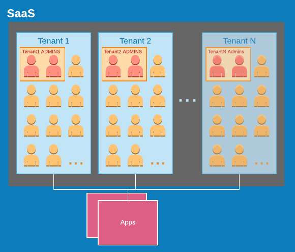

# Introduction

The Okta Identity Cloud provides a rich set of APIs and services that can be used to develop custom solutions for SaaS use-cases. We demonstrate these capabilities with [okta-dac](https://github.com/udplabs/okta-dac), a project that implements the common use-case(s) of providing delegated administration (aka "self service") capabilities to SaaS tenants.

::: warning
Code and documentation are provided as-is.
:::
