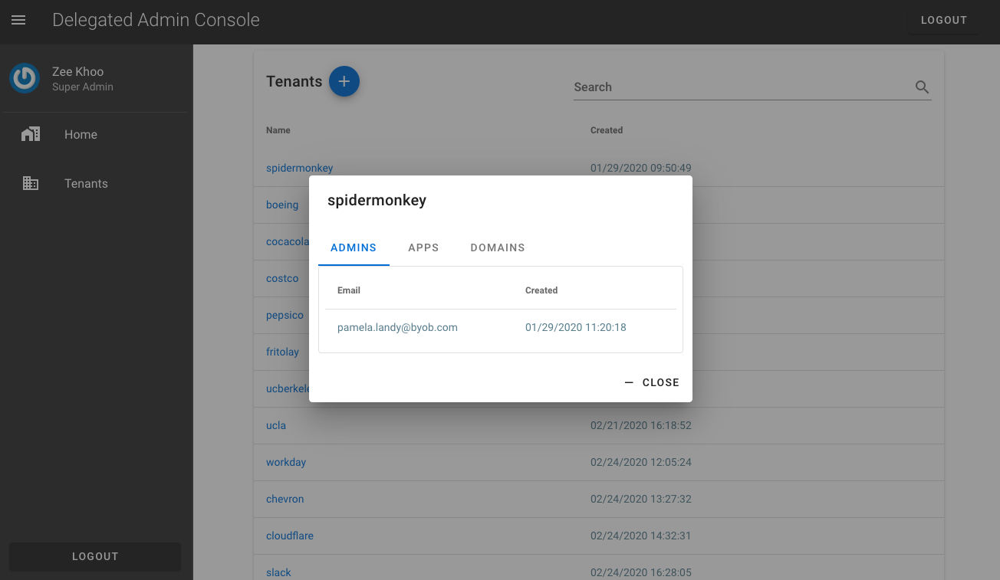

# Introduction
This is the design architecture documentation for the "__Delegated Admin Console__" aka [okta-dac](https://github.com/udplabs/okta-dac) open source project *and its companion project, "__End-user Dashboard__" aka [byob-dashboard](https://github.com/oktadeveloper/byob-dashboard)*.

Using native Okta capabilities, we:
1. **Add a "tenant" layer to an Okta Org** using custom setup of [Groups](/guide/architecture.html#groups) and [Roles](/guide/architecture.html#group-admin-role)
2. **Provide tenant self-service administration** by leveraging [OAuth for Okta](/guide/architecture.html#oauth-for-okta). 
    * Users in any particular tenant can have 1 of 2 roles: *User* and *Tenant Admin*. Tenant Admins can access the __Delegated Admin Console__ app. And all users can access the __End-user Dashboard__ app.
3. **Support "bring your own IdP"** using Okta's [Inbound Federation](https://developer.okta.com/docs/concepts/identity-providers/) functionality
4. **Protect API resources** with Okta's [API Access Management](/guide/architecture.html#api-access-management)
    * We configure Okta to generate JWTs embedding tenant info; We design our API endpoints to implement tenant-namepsace in the request url; And we implement a custom authorizer to restrict access to the tenant-namepsaced route based on tenant info embedded in the JWT (the Bearer token of the API request).

## Delegated Admin Console
This section discusses the Admin App

### Superuser
The Okta org must be configured to have a __SUPERUSERS__ group. Any user assigned to this group will see the superuser admin UI upon logging in to DAC:

__Superusers:__
* Add new Tenants
* Create the Tenants' first user (the first [Tenant Admin](#tenant-admin))
* Designate which Apps the Tenant can access
* Designate email Domains that belong to the Tenant

### Tenant Admin

The Tenant Admin role allows users to self manage their tenants:
* Manage Users
    * Add Users
    * Update users' profile
    * Update user statuses (Activate, Deactivate, Suspend, etc.)
    * Assign Tenant Admin roles to other users
    * Assign/Unassign Applications to users
* Self-configure an IdP for SAML Authentication
* Self-verify email Domains

## End-user Dashboard

The End-user Dashboard is the companion app to okta-dac. Users login to this application to:
* Access SSO Applications assigned to them
* Manage their own profile:
    * Update profile
    * Change password
    * Enroll/unenroll other factors