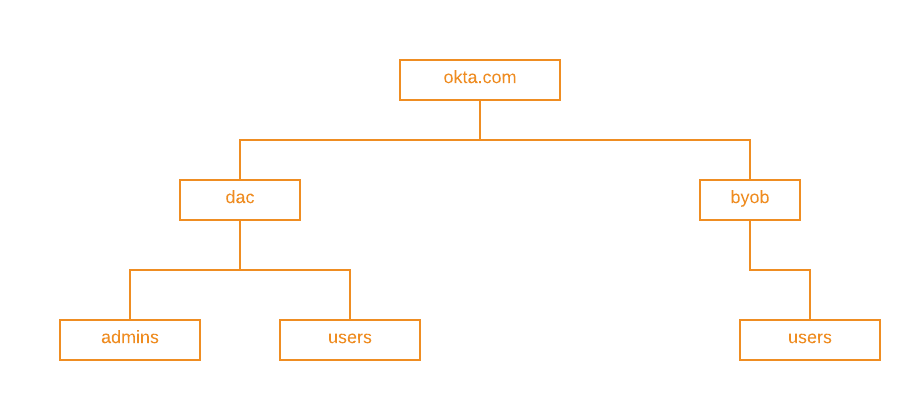

# Introduction
This section describes the Architecture

## Architecture
### Groups
Although Groups in Okta are flat in structure and only store name and description, it is acceptable practice to use naming convention and/or namespacing to simulate group-types, group hierarchy or nested group structures. One key feature of Okta Groups is that the API supports [search](https://developer.okta.com/docs/reference/api/groups/#search-groups) with ***startsWith***, which allows us to support our architecture. We illustrate with some examples, below.

**Example 1: Group Hierarchy**

Okta can support nested groups (or group hierarchy) by applying namespacing to the group name. For example, a hierarchy looking like the following:

Can be *flattened* and represented with the following group naming convention:

| Group Name |
| ---------- |
| okta.com   |
| okta.com/dac |
| okta.com/dac/admins  |
| okta.com/dac/users  |
| okta.com/byob |
| okta.com/byob/users |

**Example 2: Group Types**

Okta can support having group types by naming convention by prefixing group names with the group type:
| Type       | Group      | Naming Convention |
| ---------- | ---------- | ----------------- |
| role       |  readonly  |  role_readonly    |
| role       |  admin     |  role_admin       |
| ou         |  sales     |  ou_sales         |
| ou         | engineering|  ou_engineering   |
* In order to list all the groups of a single type, use the search groups API with `search string = group type`
    ```
    GET https://${yourOktaDomain}/api/v1/Groups?q=${groupType}
    ```
* In order to search for a group by name (within a group type) simply prefix the search string with the group type
    ```
    GET https://${yourOktaDomain}/api/v1/Groups?q=${groupType}startsWith
    ```

**Okta Multi Tenant Admin Usage:**

In this project, we employ the *Example 2* design pattern to create 2 classes of users – 1) Admins, and 2) Users – By prefixing group names with either **ADMINS_** and **USERS_**, respectively.


### Group Admin Role
Okta supports **delegated admin** functionality by allowing users to hold the [Group Admin Role](https://help.okta.com/en/prod/Content/Topics/Security/admin-role-groupadmin.htm) role. This functionality allows specific groups to be designated to specific Group Admins; And will restrict the Group Admins to only be able to view and perform updates those specifc groups (and the users in them).

Read more about the different [Administrator Roles](https://help.okta.com/en/prod/Content/Topics/Security/Administrators.htm) in Okta to get a better understanding of how we leveraged the Group Admin role.

### OAuth for Okta
[OAuth for Okta](https://developer.okta.com/docs/guides/implement-oauth-for-okta/overview/) overview

### API Access Management
[API Access Management](https://developer.okta.com/docs/concepts/api-access-management/) overview

## API
#### [API Reference](/api)
This section discusses the API design

## Admin App
This section discusses the Admin App


## End-User Dashboard
This section discusses the End-User Dashboard


