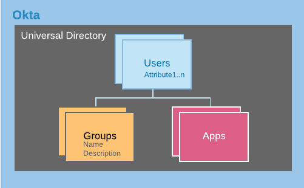
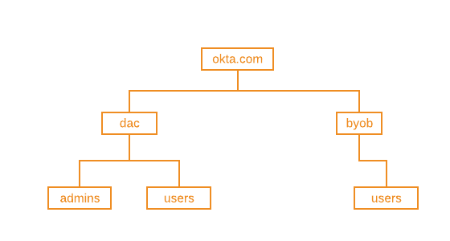
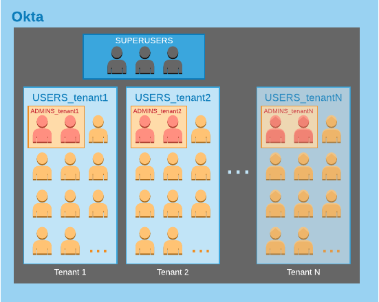

# Architecture

## Okta Basics: Users, Groups & Apps

* An Okta Org supports having only one directory of users, who belong to one or more groups. 
* Groups in Okta are flat, but users can belong to any number of groups. 
* Users are *assigned* to apps. 
* Groups can also be assigned to apps (When a group is assigned to an app, all users of the group are assigned to the app). 
* The user object can store any number of custom attributes. 
* Groups can store a name and description. 



## Groups
Although Groups in Okta are flat in structure and only store name and description, it is acceptable practice to use naming convention and/or namespacing to simulate group-types, group hierarchy or nested group structures. **A key feature of Okta groups which allows us to do this is the groups API [search](https://developer.okta.com/docs/reference/api/groups/#search-groups) that supports *startsWith***. Lets illustrate with a couple examples, below.

### Example 1: Group Hierarchy

You can implement nested groups (or group hierarchy) by applying hierarchical namespacing to the group name. For example, a hierarchy looking like the following:


Can be *flattened* and represented with the following naming convention:

| Group Name |
| ---------- |
| okta.com   |
| okta.com/dac |
| okta.com/dac/admins  |
| okta.com/dac/users  |
| okta.com/byob |
| okta.com/byob/users |

---
### Example 2: Group Types

You can implement group types by prefixing group names with the group type:
| Type       | Group      | Naming Convention |
| ---------- | ---------- | ----------------- |
| role       |  readonly  |  role_readonly    |
| role       |  admin     |  role_admin       |
| ou         |  sales     |  ou_sales         |
| ou         | engineering|  ou_engineering   |
* In order to list all the groups of a single type, use the search groups API with `search string = group type`


| GET | `https://${yourOktaDomain}/api/v1/Groups?q=${groupType}` |
| --- | --- |

* In order to search for a group by name (within a group type) simply prefix the search string with the group type

| GET | `https://${yourOktaDomain}/api/v1/Groups?q=${groupType}${startsWith}` |
| --- | --- |

---
### okta-dac mapping

#### ADMINS_ and USERS_ Groups
In the okta-dac project, we use the *Example 2* design pattern to create 2 types of user groups – 1) Admins, and 2) Users – by prefixing group names with either **ADMINS_** and **USERS_**, respectively. The string following the prefix refers to the tenant name. 

For example, if we have 2 customers, `tenant1` and `tenant2` in our SaaS application, we'll have 2 sets of groups: `ADMINS_tenant1` + `ADMINS_tenant2` and `USERS_tenant1` + `USERS_tenant2`. Each customer's user is a member of their respective `USERS_` group. If the user is also a Tenant Admin, they'll be assigned to the `ADMINS_` group. 

With this naming convention in place, we've coerced our Okta org into a structure that our SaaS application needs:



#### SUPERUSERS Group
We mentioned "Superusers" before so lets go over how we modeled this in Okta. As previously described [here](/guide/#superuser), the "Superuser" __role__ allows access to the **okta-dac superuser UI**. We model this by creating a __SUPERUSERS__ group in our Okta Org, as illustrated in the diagram above. By simply adding a user into this group, they experience the Superusers UI when logging into otkta-dac. We [configure Okta](/guide/org-setup.html#_5-add-custom-claims) to include the list of groups memberships in users' JWT; And business logic coded in the okta-dac app interprets the JWT information to determine if the user is a superuser or not.

#### APPUSERS_ Groups
Each tenant will of course have access to the suite of applications the SaaS provides, but not every tenant will have every application in the suite of products. We'll model this by setting up the `APPUSERS` group: For every app that a tenant is entitled to, a group `APPUSERS_${tenant}_${appId}` is created. These groups are assigned to the respective app. And in okta-dac, when we assign a user to an app using the UI, behind the scenes we use the Okta API to add the user to the group.


## Group Admin Role
Okta natively supports **delegated admin** functionality at the group level via the [Group Admin Role](https://help.okta.com/en/prod/Content/Topics/Security/admin-role-groupadmin.htm). You can configure rules in Okta to allow users in a group to gain permissions to read and manage a list of specific groups. Using this functionality, **we configure `ADMINS_tenant` groups as the group admins for `USERS_tenant` and `APPUSERS_tenant` groups**. Thus, the result is the following behavior:
* Tenant Admins are part of their own `ADMINS_${tenant}` group, so they can then read and manage users in their `USERS_${tenant}` group. 
* And they can assign/unassign apps for their users by being able to add/remove `USERS_${tenant}` users to/from their `APPUSERS_${tenant}` groups.

::: tip Additional Reading
Read more about the different [Administrator Roles](https://help.okta.com/en/prod/Content/Topics/Security/Administrators.htm) in Okta to get a better understanding of how we leveraged the Group Admin role
:::

## IdPs
One key functionality of okta-dac is the ability for Tenant Admins to self configure their own IdPs for SAML authentication. Okta provides support for [External Identity Providers](https://developer.okta.com/docs/concepts/identity-providers/) out of the box. 

In okta-dac, we maintain a mandatory 1:1 mapping between a Tenant and its (potential) IdP (in Okta, we always create one IdP per Tenant regardless of whether the Tenant is going to use IdP authentication). IdP settings are simply set to `status=inactive` where the Tenant is not using IdP authentication.

The 1:1 mapping allows us to do a couple things:
1. First, we overload IdP to be Tenant
    * We use IdP id as Tenant id.
    * We store this id in the `profile.description` of the `ADMINS_` group as a JSON string:
    ```json{12}
    {
        "id": "00gpht48f2bSI7jZw0h7",
        "created": "2020-01-29T17:55:02.000Z",
        "lastUpdated": "2020-05-02T23:15:32.000Z",
        "lastMembershipUpdated": "2020-02-11T23:47:59.000Z",
        "objectClass": [
            "okta:user_group"
        ],
        "type": "OKTA_GROUP",
        "profile": {
            "name": "ADMINS_spidermonkey",
            "description": "{\"tenantId\": \"0oaphsztw1XNmNqbb0h7\"}"
        }
    }
    ```
2. Allows us to implement the [List Tenants](/api/#list-tenants-with-pagination) API. 
    * We wrap around the [list identity providers](https://developer.okta.com/docs/reference/api/idps/#list-identity-providers) API (which supports pagination) and map its results to display them as Tenant info.
        * This allows us to support reading back thousands of Tenants in paginated results.
        * We could have used [search groups](https://developer.okta.com/docs/reference/api/groups/#search-groups) to search the `ADMINS_` groups instead. But this API would not have given us pagination and is limited to 300 results.

# Finally, our entity map looks like the following:


__Head over to the [next ->](api-design) section for a discussion on the backend design.__
