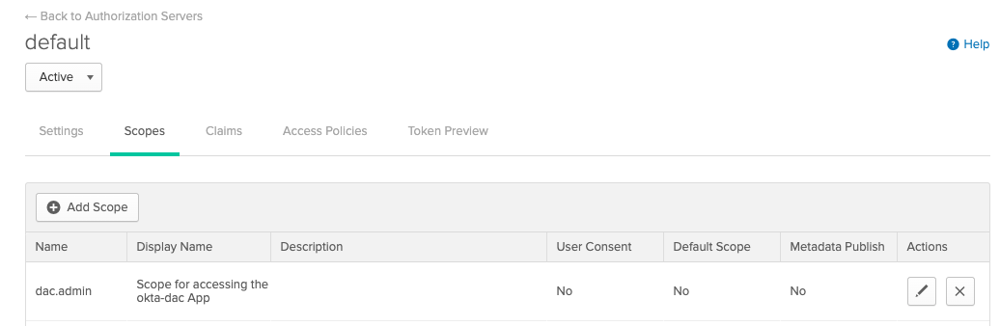
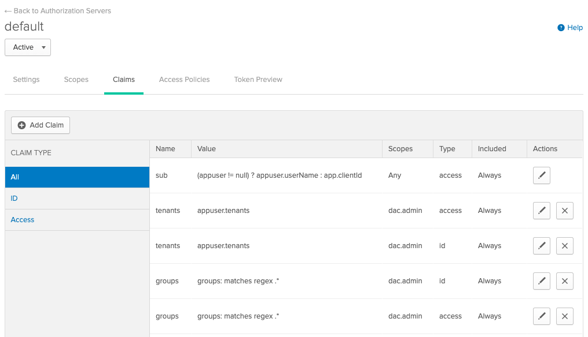
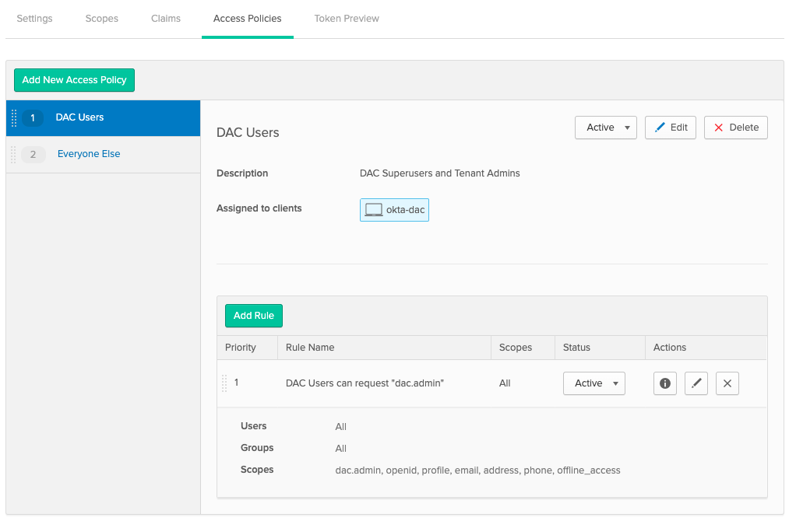

# Org Configuration

## Terraform
We use the [Okta Terraform Provider](https://www.terraform.io/docs/providers/okta/index.html) to automatically configure the Okta Org. Refer to the [setup](/setup/terraform.html) section for more information. 

If you're more comfortable configuring the org manually, Follow the steps below: 

## Configuration
* Add SUPERUSERS Group
* Add byob-dashboard app
    * Application type: __Single Page App (SPA)__
    * Allowed grand types: __Authorization Code__
    * Login redirect URIs: __http://localhost:8080/oauth/callback__
    * Client authentication: __Use PKCE (for public clients)__

* Add okta-dac app
    * Application type: __Single Page App (SPA)__
    * Allowed grand types: __Authorization Code__
    * Login redirect URIs: __http://localhost:8080/oauth/callback__
    * Client authentication: __Use PKCE (for public clients)__
    * Add custom profile attribute to the __App Profile__
        * Data type: __string array__
        * Display name: __Tenants__
        * Attribute type: __Group__
        * Group Priority: __Combine values across groups__
    

* Add custom `dac.admins` scope to the `default` AuthorizationServer
    

* Add custom claims
    
    Setup claims bound to the custom scope `dac.admin` with the following values:

    | name | expression | scope | token |
    | ---- | ---------- | ----- | ----- |
    | tenants | appuser.tenants | dac.admin | id_token & access_token |
    | groups | groups matches .* | dac.admin | id_token & access_token |
    

* Configure Access Policies
    1. Add a policy: 
        * Name: __DAC Users__
        * Assigned to clients: __okta-dac__
        * Add a rule:
        IF `Grant type is Authorization Code` AND `User is Any user assigned the app` AND `Scopes requested = Any Scopes` THEN `No inline hook` AND `Access token lifetime is 1 Hours` AND `Refresh token lifetime is unlimited`
    
    2. Update the default policy:
        * Name: Can leave as is. We decided to name it __Everyone Else__
        * Assigned to clients: __All Clients__
        * Configure the default policy rule:
        IF `Grant type is Authorization Code` AND `User is Any user assigned the app` AND `Scopes requested = [openid, profile, email, address, phone, offline_access]` THEN `No inline hook` AND `Access token lifetime is 1 Hours` AND `Refresh token lifetime is unlimited`        
    